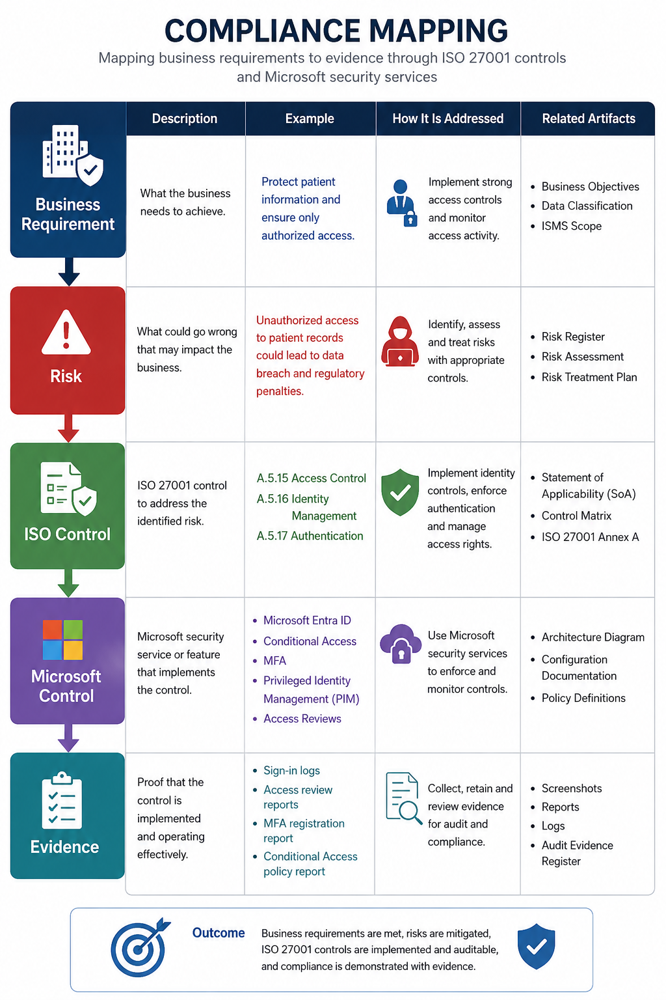

# Azure ISO 27001 Compliance & Monitoring Lab

## Healthcare Security Governance Project

### LockedWings Security Consulting

---

# Overview

This project simulates a real-world consulting engagement in which LockedWings Security Consulting implements an ISO/IEC 27001:2022-aligned Information Security Management System (ISMS) for a fictional healthcare organization, MedSecure Health Analytics.

The objective was to design governance processes, identify and treat information security risks, implement Microsoft security controls, establish centralized monitoring, collect audit evidence, and demonstrate compliance readiness using Azure and Microsoft 365 technologies.

Unlike a traditional Azure security lab, this project focuses on Governance, Risk, and Compliance (GRC) principles by connecting business requirements, risks, controls, technical implementations, and audit evidence.

---

# Business Scenario

## Client

MedSecure Health Analytics

## Industry

Healthcare Analytics

## Regulatory Drivers

* ISO/IEC 27001:2022
* POPIA
* Healthcare Data Protection Requirements

## Critical Assets

* Patient Records
* Research Data
* Employee Information
* Azure Infrastructure
* Microsoft 365 Environment

---

# Project Objectives

* Establish an ISO 27001-aligned ISMS
* Create governance and compliance documentation
* Build a risk register and treatment plan
* Implement identity security controls
* Deploy centralized security monitoring
* Map technical controls to ISO requirements
* Collect audit evidence
* Demonstrate compliance readiness

---

# Security Architecture

.

The environment was designed using a defense-in-depth approach:

Users

↓

Microsoft Entra ID

↓

Conditional Access

↓

Azure Resources

↓

Log Analytics

↓

Microsoft Sentinel

↓

Security Operations

Supporting services:

* Microsoft Defender for Cloud
* Microsoft Defender XDR
* Azure Key Vault
* Azure Policy
* Azure Monitor

---

# ISO 27001 Scope

## In Scope

* Azure Subscription
* Microsoft 365 Tenant
* Entra ID
* Microsoft Sentinel
* Azure Key Vault
* Azure Storage
* Azure Monitoring

## Out of Scope

* Physical Security
* Third-Party Hospital Systems
* Personal Devices

---

# Risk Assessment

The project identified and assessed key business risks.

| Risk                     | Treatment           |
| ------------------------ | ------------------- |
| Admin Account Compromise | MFA + PIM           |
| Unauthorized Access      | RBAC                |
| Data Exposure            | Encryption          |
| Cloud Misconfiguration   | Defender for Cloud  |
| Undetected Attack        | Sentinel Monitoring |

[RISK HEAT MAP IMAGE HERE]

---

# ISO 27001 Controls Implemented

| Control | Description                |
| ------- | -------------------------- |
| A.5.9   | Asset Inventory            |
| A.5.12  | Information Classification |
| A.5.15  | Access Control             |
| A.5.16  | Identity Management        |
| A.5.17  | Authentication             |
| A.5.18  | Access Rights              |
| A.5.23  | Cloud Services             |
| A.5.24  | Incident Management        |
| A.5.25  | Security Event Assessment  |
| A.5.36  | Compliance Reviews         |
| A.8.9   | Configuration Management   |
| A.8.15  | Logging                    |
| A.8.16  | Monitoring                 |
| A.8.20  | Network Security           |
| A.8.24  | Cryptography               |
| A.8.28  | Secure Development         |
| A.8.32  | Change Management          |

---

# Identity Governance

## Multi-Factor Authentication

Implemented MFA for all users.

[MFA POLICY SCREENSHOT HERE]

---

## Conditional Access

Implemented:

* Require MFA
* Block Legacy Authentication
* Admin Protection
* Risk-Based Access

[CONDITIONAL ACCESS POLICY SCREENSHOT HERE]

---

## Privileged Identity Management

Implemented:

* Just-In-Time Access
* Approval Workflow
* Time-Limited Elevation

[PIM CONFIGURATION SCREENSHOT HERE]

---

## Access Reviews

Quarterly access reviews implemented.

[ACCESS REVIEW SCREENSHOT HERE]

---

# Azure Security Controls

## Microsoft Defender for Cloud

Implemented:

* Secure Score Monitoring
* Regulatory Compliance
* Recommendations

[DEFENDER SECURE SCORE SCREENSHOT HERE]

---

## Azure Key Vault

Implemented encryption and secrets management controls.

[KEY VAULT SCREENSHOT HERE]

---

## Network Security

Implemented:

* Network Security Groups
* Azure Firewall Controls

[NSG SCREENSHOT HERE]

---

# Security Monitoring

## Microsoft Sentinel

Centralized SIEM implementation.

[SENTINEL OVERVIEW SCREENSHOT HERE]

---
## Data Flow

.

---

## Data Connectors

Connected:

* Entra ID Logs
* Microsoft 365 Logs
* Azure Activity Logs

[DATA CONNECTORS SCREENSHOT HERE]

---

## Detection Rules

Implemented detections for:

* Failed Sign-Ins
* MFA Disabled
* New Admin Assignment
* Resource Deletion
* User Creation

[ANALYTICS RULES SCREENSHOT HERE]

---

## Incident Management

Example incident investigation workflow.

[INCIDENT SCREENSHOT HERE]

---

# Compliance Mapping

Business Requirement

↓

Risk

↓

ISO Control

↓

Microsoft Control

↓

Evidence

.

---

# Audit Evidence

Examples collected:

* MFA Configuration
* PIM Configuration
* Conditional Access
* Sentinel Deployment
* Logging Configuration
* Defender Secure Score
* Key Vault Configuration

[EVIDENCE REGISTER IMAGE HERE]

---

# Governance Deliverables

## ISMS

* Company Profile
* Scope Document
* Asset Register
* Information Classification Policy

## Risk Management

* Risk Register
* Risk Treatment Plan
* Risk Methodology

## Compliance

* Statement of Applicability
* Control Matrix
* Evidence Register
* Control Mapping

---

# Gap Analysis

Areas identified for improvement:

* Business Continuity Planning
* Disaster Recovery
* Supplier Risk Management
* Security Awareness Training
* Secure Development Lifecycle
* Compliance Automation

[GAP ANALYSIS SUMMARY IMAGE HERE]

---

# Skills Demonstrated

### Governance

* ISO 27001
* Risk Management
* Compliance Assessment
* Policy Development

### Cloud Security

* Azure Security
* Microsoft Defender
* Key Vault
* Network Security

### Identity Security

* Entra ID
* MFA
* Conditional Access
* PIM

### Security Operations

* Microsoft Sentinel
* KQL
* SIEM Monitoring
* Incident Response

### Reporting

* Power BI
* Executive Reporting
* Compliance Metrics

---

# Project Outcome

This project demonstrates the implementation of a healthcare-focused ISO 27001 compliance program using Microsoft Azure and Microsoft 365 technologies.

The project establishes traceability between business risks, security controls, technical implementations, and audit evidence while demonstrating practical Governance, Risk, and Compliance capabilities.
